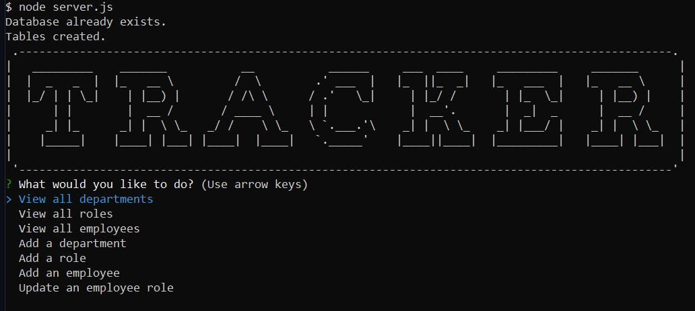

# Company Employee Tracker

## Description
The Employee Tracker is a command-line application that helps business owners manage their company's employee database efficiently. Using this application, you can easily view and manage departments, roles, and employees, ensuring that all business-related information is well-organized and accessible. This project uses Node.js, Inquirer, and PostgreSQL to build a content management system (CMS) that facilitates interaction with the company's database.

## Table of Contents
* [Installation](#installation)
* [Usage](#usage)
* [License](#license)
* [Contributing](#contributing)
* [Tests](#tests)
* [Credits](#credits)
* [Questions](#questions)

## Installation
Installation to install dependencies: enter 'npm install' into the command line.

## Usage
Start the application by running 'node index.js' in the command line. Once the application is running, you will be presented with the following options:

View Departments: View a list of all departments with their names and IDs.
View Roles: View all job roles, including the job title, role ID, department, and salary.
View Employees: View detailed employee information, including IDs, names, job titles, departments, salaries, and managers.
Add Department: Add a new department by providing the department name.
Add Role: Add a new role by specifying the role name, salary, and department.
Add Employee: Add a new employee by entering their first name, last name, role, and manager.
Update Employee Role: Update an existing employee's role by selecting the employee and specifying the new role.

Use the arrow keys to navigate the menu and select an option. Follow the prompts to enter the necessary information or perform the desired action. 

A walkthrough video demonstrating the functionality of the Employee Tracker is available [here](https://drive.google.com/file/d/1K33tuzicUFzOMAfITBHw3fTBLUJsKdmB/view?usp=sharing)

## License
This project is licensed under the MIT license. Please feel free to read the license in full detail [here](https://opensource.org/license/mit)

## Contributing
Please contact me with contributions to the repo.

## Tests
N/A

## Credits
[patorjk](https://patorjk.com/) for the ASCII Art

## Questions
Please contact me with any additional questions.

Github: hannahpsmith (https://github.com/hannahpsmith)

Email: hannahpsmith94@gmail.com
